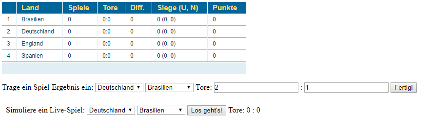

# Projekt: SoccerTab

Name & Praktikumstermin: David Waldmann, <Matrikelnummer> (Die/1, Hb)

<Inhaltsverzeichnis>

## Kurzbeschreibung

> Die Anwendung "SoccerTab" stellt eine Fußball-Tabelle dar,
  die sich automatisch mit neuen Ergebnissen aktualisiert. Da dies schwer mit LIVE-
  Spielen zu demonstrieren ist, wird ein Live-Match simuliert und die Tabelle dann
  während des laufenden Spiels aktualisiert.
  Es gibt außerdem noch die Möglichkeit fertige Spielstände einzutragen. Es lassen
  sich mehrere Fenster öffnen, und ein in einem Fenster gestartetes Live-Spiel wird
  über Websockets in allen Fenstern angezeigt, und die Tabellen entsprechend
  aktualisiert.





## Beschreibung des Projektaufbaus

### Abgabedateien (LOC)

Verlinkter Dateiname | Dateiart | LOC
---------------------|----------|-----
[App.java](\src\main\java\App.java) | Java | 70
[ICountry.java](\src\main\java\ICountry.java) | Java | 10
[Country.java](\src\main\java\Country.java) | Java | 150
[ITable.java](\src\main\java\ITable.java) | Java | 9
[Table.java](\src\main\java\Table.java) | Java | 59
[Match.java](\src\main\java\Match.java) | Java | 38
[SimulatedLiveMatch.java](\src\main\java\SimulatedLiveMatch.java) | Java | 72
[Goals.java](\src\main\java\Goals.java) | Java | 40
[WinLooseTie.java](\src\main\java\WinLooseTie.java) | Java | 40
[index.html](\src\main\resources\public\index.html) | HTML | 130
[javascript.js](\src\main\resources\public\javascript.js) | Javascript | 37
[Screenshot.png](\src\main\resources\public\screenshot.png) | Bild

### Testdateien (TST)

Verlinkter Dateiname | Testart | Anzahl der Tests
---------------------|---------|-----------------
[SoccerTest.java](\src\test\java\SoccerTest.java) | JUnit5 | 60

Die Tests werden wie folgt ausgeführt:

Ich hoffe, das kann ich bis zur Abgabe noch herausfinden. Ich führe die Tests
in IntelliJ per "Knopfdruck" aus.

### Aufbau der Anwendung

Datei | Aufgabe 
---------------------|----------
[App.java](\src\main\java\App.java) | Hier wird der **Javalin-Server** aufgesetzt, und die **Websockets** eingerichtet
[ICountry.java](\src\main\java\ICountry.java) | Interface für Country (s.u.)
[Country.java](\src\main\java\Country.java) | Klasse für eine **Mannschaft**, mit Statistiken wie Punkten, Toren, Gegentoren usw
[ITable.java](\src\main\java\ITable.java) | Interface für Table (s.u.)
[Table.java](\src\main\java\Table.java) | Klasse für die **Tabelle**, der über den Konstruktor neue Länder hinzugefügt 
<d>| werden können, und die die enthaltenen Länder sortieren kann, und neue Matches hinzufügen kann
[Match.java](\src\main\java\Match.java) | Klasse für ein **Match**, das die beteiligten Mannschaften und das End-Ergebnis enthält
[SimulatedLiveMatch.java](\src\main\java\SimulatedLiveMatch.java) | Klasse für ein simuliertes **Live-Spiel**, das Daten enthält, damit der Tabelle Zwischenstände übergeben werden können, ohne dass Tore oder Punkte doppelt verbucht werden.
[Goals.java](\src\main\java\Goals.java) | Klasse für die **Tor-Statistik** einer Mannschaft, mit Gegentoren und Tordifferenz
[WinLooseTie.java](\src\main\java\WinLooseTie.java) | Klasse für die **Sieg-Niederlage**-Unentschieden-Bilanz einer Mannschaft
[index.html](\src\main\resources\public\index.html) | HTML-Datei, in der die **GUI** definiert wird
[javascript.js](\src\main\resources\public\javascript.js) | Javascript-Datei, die die Verbindung zwischen GUI und Javalin herstellt.


## Dokumentation des implementierten WebAPIs

Request/Reply | Funktion
--------|---------
[App.java](\src\main\java\App.java) |
"/livematch" (WS) | Der Websocket-Pfad **"/livematch"** wird aktiviert, wenn in der GUI zwei Mannschaften für ein Live-Spiel ausgewählt und der entsprechende Button gedrückt wird, um das Spiel zu starten. Dann wird Javalin die Auswahl übergeben, und daraufhin ein Spiel gestartet. Anschließend wird in regelmäßigen Abständen das gerade aktuelle Ergebnis des Live-Spiels abgefragt, und die entsprechend aktualisierte Tabelle (per toString) mitsamt Spielstand über JSON an den Client geschickt. 
"/start" | **"/start"** wird beim ersten Laden der Seite aufgerufen, und tut nichts anderes, als die Tabelle zu initialiseren und zur Anzeige in der GUI per ctx.result() zurückzugeben.
"/addgame" | **"/addgame"** wird aktiviert, wenn in der GUI ein fertiges Spielergebnis eingetragen wird. Über die Parameter wird das Ergebnis Javalin mitgeteilt, woraufhin wieder die Tabelle aktualisiert zurückgegeben wird.


## Dokumentation der Interfaces

Methode | Funktion
--------|---------
[ICountry.java](\src\main\java\ICountry.java) | 
String getName(); | gibt den **Ländernamen** zurück
int getGamesPlayed(); | gibt Anzahl **gespielter Spiele** zurück
WinLooseTie getWinLooseTie(); | gibt die **Sieg-Niederlage**-Unentschieden-Statistik zurück
Goals getGoals(); | gibt Goals zurück, das **Tore**, Gegentore und Tor-Differenz enthält.
int getPoints(); | gibt die Gesamt-**Punkte** aller bisher gespielten Spiele der Mannschaft zurück
void update(int goals, int goalsAgainst); | Gibt dem Land ein Update der Werte (Tore, Punkte, usw) gemäß dem endgültigen Ergebnis eines **beendeten Spiels**
void liveUpdate(int oldGoals, int oldGoalsAgainst, int newGoals, int newGoalsAgainst, boolean alreadyStarted); | Gibt dem Land ein Update der Werte (Tore, Punkte, usw) gemäß dem aktuellen Spielstand eines **Live-Spiels**
int points(int goals, int goalsAgainst); | Berechnet, wie viele Punkte der eingegebene Spielstand ergibt
[ITable.java](\src\main\java\ITable.java) | 
void sortCountries(); | sortiert die Länder nach der vorgegebenen Reihenfolge. Hier: Zuerst nach Punkten, dann nach Tordifferenz, und als letztes nach dem Ländernamen
Map<String, ICountry> getCountries(); | Gibt die Liste aller in der Tabelle enthaltenen Länder zurück
ICountry getCountryOnPosition(int position); | Gibt das Land auf der gewünschten Position in der Tabelle zurück
void update(Match match); | Aktualisiert die Tabelle gemäß dem Ergebnis des eingegebenen Spiels
JSONObject liveUpdate(SimulatedLiveMatch simMatch, boolean alreadyStarted); | Aktualisiert die Tabelle gemäß dem aktullen Spielstand eines Live-Spiels, und gibt ein JSONObject mit dem Spielstand zurück (das für die Übermittlung zum Client benötigt wird)


## Technischer Anspruch (TA) und Umsetzung der Features

Ich habe folgende Features verwendet. Die verlinkte Datei zeigt beispielhaft den Einsatz dieses
Features in den angegebenen Zeilen im Quellcode.

1. WebSockets, [App.java](\src\main\java\App.java) (30-74)
2. JSON, [javascript.js](\src\main\resources\public\javascript.js) (39-46)

Über Websockets können mehrere Fenster der Anwendung geöffnet werden und miteinander synchronisiert werden.
Außerdem ist es eine wichtige Grundlage, dass noch ein Upgrade stattfinden kann, tatsächlich Live-Daten aus
dem Internet abzurufen.

Per JSON können die Daten der Länder und neue Spielstände sehr unkompliziert übertragen werden.

## Projekt SoccerTab

### Start-Bedingungen

Wenn die Anwendung gestartet wird, zeigt sich einem oben gezeigtes Bild:


Das onload-Attribut des HTML-Body sorgt beim ersten Laden der Seite dafür, dass ein Get-Request "/start" gestellt wird, und damit die anfängliche Tabelle angefordert wird:

```html
<!-- index.html -->
<body onload="loadTable()">
<div class="datagrid">
    <table id="table">
        <!--Hier kommt der Tabelleninhalt hin-->
    </table>
</div>
```
```javascript
// javascript.js
function loadTable() {
    sendRequestGET('start');
}
```
```java
// App.java
public class App {
    public static void main(String[] args) {
        Javalin app = Javalin.create()
                .enableStaticFiles("/public")
                .start(7000);

        Country de = new Country("Deutschland"), gb = new Country("England"),
                es = new Country("Spanien"), br = new Country("Brasilien");
        ITable table = new Table(new Country[]{de, gb, es, br});
        // [...]
  	}
 }
app.get("/start", ctx -> ctx.result(table.toString()));
```
Wie man sieht, wurden (schon bevor der Get-Request übertragen wurde) in der App.java 4 Objekte vom Typ `Country` erstellt, die die 4 Länder in der Tabelle repräsentieren. Diese wurden anschließend dem Konstruktor des Tabellen-Objekts `table` übergeben.

Es sind also alle Grundlagen gegeben, dass in `/start` per ctx.result() eine fertig initialisierte Tabellen-Repräsentation zurückgegeben werden kann, per toString().
Es werden die Statistiken jedes Landes ausgelesen, und der String zusammengesetzt. Am Ende sieht das ganze so aus:
```html
<thead>
    <tr>
        <th></th>
        <th>Land</th>
        <th>Spiele</th>
        <th>Tore</th>
        <th>Diff.</th>
        <th>Siege (U, N)</th>
        <th>Punkte</th>
    </tr>
</thead>
<tbody>
    <tr>
        <td>0</td>
        <td>Deutschland</td>
        <td>0</td>
        <td>0:0</td>
        <td>0</td>
        <td>0 (0, 0)</td>
        <td>0</td>
    </tr>
    [... entsprechend für die 3 anderen Länder ...]
</tbody>
```
Die `http.onreadystatechange` Funktion wartet geduldig auf neue Responses und setzt den empfangenen Tabellen-String in die HTML ein.
```javascript
// javascript.js
http.onreadystatechange = function() {
    if (this.readyState === 4 && this.status === 200) {
        document.getElementById('table').innerHTML = this.responseText;
    }
};
```


Gegeben ist also eine Tabelle mit 4 Mannschaften, und der User kann jetzt entweder den **Spielstand eines beendeten Spiels** eintragen, oder die **Simulation eines Live-Spiels** zwischen zwei Mannschaften seiner Wahl starten.

Wer den Spielstand eines beendeten Spiels einträgt, schickt ein GET-Request `/addgame` auf die Reise, mit beiden beteiligten Ländern, und Anzahl der Tore als Parameter im Gepäck.

```javascript
// javascript.js
function addGame() {
    sendRequestGET('addgame', 'country0=' + document.getElementById('country0').value +
        '&country1=' + document.getElementById('country1').value +
        '&goals1=' + document.getElementById('goals1').value +
        '&goals2=' + document.getElementById('goals2').value);
    // Eingabefelder werden gecleart
    document.getElementById('goals1').value = '';
    document.getElementById('goals2').value = '';
}
```
Die Tabelle wird entsprechend des Ergebnisses des Spiels aktualisiert (Für näheres über die ITable-Methoden siehe Beschreibung der Interfaces)
```java
// App.java
app.get("/addgame", ctx -> {
            String country1 = (ctx.queryParam("country0"));
            String country2 = (ctx.queryParam("country1"));
            int goals1 = Integer.parseInt(ctx.queryParam("goals1"));
            int goals2 = Integer.parseInt(ctx.queryParam("goals2"));
            table.update(new Match(countries.get(country1), countries.get(country2), goals1, goals2));
            ctx.result(table.toString());
        });
```

Damit table eine **sortierte Tabelle** zurückgeben kann, wird in der toString()-Methode (s.o) sortCountries() aufgerufen, das die Liste der Countries mit Collections.sort() sortiert:

```java
// Table.java
private List<ICountry> countryList;

@Override
public void sortCountries() {
    Collections.sort(countryList);
}
```
Das geht nur, wenn ICountry auch Comparable implementiert:
```java
// Country.java
@Override
    public int compareTo(ICountry o) {
        if (o.getPoints() != points) {
            return o.getPoints() - points;
        }
        if (o.getGoals().getGoalDiff() != goals.getGoalDiff())
            return o.getGoals().getGoalDiff() - goals.getGoalDiff();
        return getName().compareTo(o.getName());
    }
```
Hier sieht man, dass zuerst nach Punkten, dann nach Tordifferenz und als letztes ganz einfach nach Alphabet sortiert wird.

### LIVE-Match
Mit sendLiveData() wird die Info, wer am Spiel teilnimmt, an den Server gesendet.
```java
function sendLiveData() {
    var json = JSON.stringify({'country0': document.getElementById('simcountry1').value,
        'country1': document.getElementById('simcountry2').value});
    // Roter Rahmen um die Spiel-Anzeige zur Verdeutlichun eines laufenden Spiels
    document.getElementById('livematch').style.border = "3px solid #ff0c10";
    ws.send(JSON.stringify(json));
}
```

In App.java setzen wir das Websocket auf, und nehmen die Daten entgegen und erzeugen ein neues SimulatedLiveMatch-Objekt simMatch. Mit simMatch.start() wird innerhalb von simMatch ein Thread gestartet, der in unregelmäßigen Abständen ein neues Tor einer zufällig gewählten Seite zuordnet.
```java
// App.java
private static Map<WsSession, String> sessions = new ConcurrentHashMap<>();


app.ws("/livematch", ws -> {
            ws.onConnect(session -> {
                sessions.put(session, "" + sessions.size());
            });

            ws.onMessage((session, message) -> {
            	// Ja ich bin mir bewusst, dass diese Zeilen ganz schlechter Stil sind. Leider hat ein Versuch eines Json-Mappers nicht funktioniert
                String msg = message.replaceAll("(\\{)|(\\\\)|(})|(\")", "");
                String[] msgs = msg.split("[,:]");

                SimulatedLiveMatch simMatch = new SimulatedLiveMatch(countries.get(msgs[1]), countries.get(msgs[3]);
                // Der Thread eines Live-Spiels wird gestartet
                simMatch.start();
                table.liveUpdate(simMatch, false);

                // [...]
            });
            ws.onClose((session, status, message) -> {
                sessions.remove(session);
            });
        });
```
Hier kann man sehen, dass in 5 Durchgängen der Thread jeweils zwischen 0 und 8 Sekunden nichts tut, und dann zufällig der Index der Mannschaft ausgewählt wird, die mit einem Tor belohnt wird. Die Unterscheidung zwischen `oldGoals` (alter Spielstand) und `newGoals` (neuer Spielstand) ist übrigens notwendig
```java
// SimulatedLiveMatch.java
private boolean matchFinished = false;
private boolean newGoalsUpdated = false;

@Override
public void run() {
    for(int i = 0; i < 5; i++) {
        try {
            sleep(1000 * r.nextInt(8));
            idxNextGoal = r.nextInt(2);
            if(newGoalsUpdated) {
                oldGoals.put(0, newGoals.get(0));
                oldGoals.put(1, newGoals.get(1));
            }
            newGoals.put(idxNextGoal, oldGoals.get(idxNextGoal) + 1);
            newGoalsUpdated = false;
        }
        catch(InterruptedException e) {
            System.out.println("e.getStackTrace() = " + Arrays.toString(e.getStackTrace()));
        }
    }
    matchFinished = true;
}
```
Die Unterscheidung zwischen `oldGoals` (alter Spielstand) und `newGoals` (neuer Spielstand) ist übrigens notwendig, damit ein neuer Spielstand korrekt eingelesen werden kann, und keine Punkte oder Tore doppelt vermerkt werden, sondern immer die Differenz geprüft werden kann. Dafür ist die `liveUpdate()`-Methode von ICountry zuständig:
```java
@Override
    public void liveUpdate(int oldGoals, int oldGoalsAgainst, int newGoals, int newGoalsAgainst, boolean alreadyStarted) {
        if(!alreadyStarted) {
            winLooseTie.addOneTie();
            points++;
            gamesPlayed++;
        }
        this.goals.addGoals(newGoals - oldGoals);
        this.goals.addGoalsAgainst(newGoalsAgainst - oldGoalsAgainst);
        this.goals.addGoalDiff(newGoals - oldGoals - newGoalsAgainst + oldGoalsAgainst);
        switch (points(newGoals, newGoalsAgainst) - points(oldGoals, oldGoalsAgainst)) {
            case 3:
                winLooseTie.addOneWin();
                winLooseTie.minusOneLoose();
                points += 3;
                break;
            case 2:
                winLooseTie.addOneWin();
                winLooseTie.minusOneTie();
                points += 2;
                break;
            case 1:
            // [...]
        }
    }
```
Um zu ermitteln, wie viele Punkte welcher Spielstand ergeben, hilft uns die Methode `points()`. Wenn Spanien zuerst 1:0 gegen Deutschland führt, wird Ihnen 3 Punkte verbucht, und in der Bilanz ein Sieg. Wenn im gleichen Spiel aber Deutschland 1 Tor schießt, müssen Spanien 2 Punkte wieder abgezogen werden (sie bekommen immer noch 1 Punkt für das Unentschieden)

Zurück zur App.java! Wie wir gesehen haben, starten wir den Thread vom Live-Spiel und aktualisieren sofort die Tabelle. Warum, wo doch noch kein "Tor gefallen" ist? Weil es gleich von Anfang an 0:0 steht, und das bedeutet 1 Punkt für jede Mannschaft!!

```java
app.ws("/livematch", ws -> {
        ws.onMessage((session, message) -> {
            // [...]
            SimulatedLiveMatch simMatch = new SimulatedLiveMatch(countries.get(country1), countries.get(country2));
            simMatch.start();
            table.liveUpdate(simMatch, false);

            for(int i = 0; !simMatch.isFinished() && i < 50; i++) {
                try {
                    Thread.sleep(2000);
                    JSONObject json = new JSONObject();
                    json.put("livematch", table.liveUpdate(simMatch, true));
                    json.put("table", table.toString());
                    broadcastMessage(json);
                }
                catch(InterruptedException e) {
                    System.out.println("e.getStackTrace() = " + Arrays.toString(e.getStackTrace()));
                }
            }
        });
        // [...]
    });
```
Ups, was passiert denn hier?? Naja, die Tore fallen ja immer erst nach einigen Sekunden. Dementsprechend müssen wir auch abwarten und in regelmäßigen Abständen auf einen neuen Spielstand abfragen.
Der ermittelte Spielstand des laufenden Spiels muss bei den Clients aller aktiven Sessions ankommen:
```java
// App.java
private static void broadcastMessage(JSONObject message) {
        sessions.keySet().forEach(ses -> {
            System.out.println("sessions.get(ses) = " + sessions.get(ses));
            ses.send(message.toJSONString());
        });
    }
```
Javascript speist das wiederum dann in die HTML ein.
```javascript
let ws = new WebSocket("ws://" + location.hostname + ":" + location.port + "/livematch");
ws.onmessage = msg => updateTable(msg);
function updateTable(msg) { // Update table
    let data = JSON.parse(msg.data);
    document.getElementById('simgoals1').innerHTML = data.livematch.goals1;
    document.getElementById('simgoals2').innerHTML = data.livematch.goals2;
    document.getElementById('table').innerHTML = data.table;
    // Wenn das Live-Spiel beendet ist, wird der rote Rahmen wieder entfernt
    if(data.livematch.isfinished) {
        document.getElementById('livematch').style.border = "";
    }
}
```
```java
```

## Quellennachweis

* Websocket auf Javascript-Seite: https://javalin.io/tutorials/websocket-example
* https://code.tutsplus.com/tutorials/real-time-sports-application-using-nodejs--cms-30594
* Hintergrundbild: https://unsplash.com/photos/nPCiBaK8WPk (Photo by Sylwia Pietruszka on Unsplash)
* Tabelle: http://tablestyler.com/#


**Hinweise**: keine
